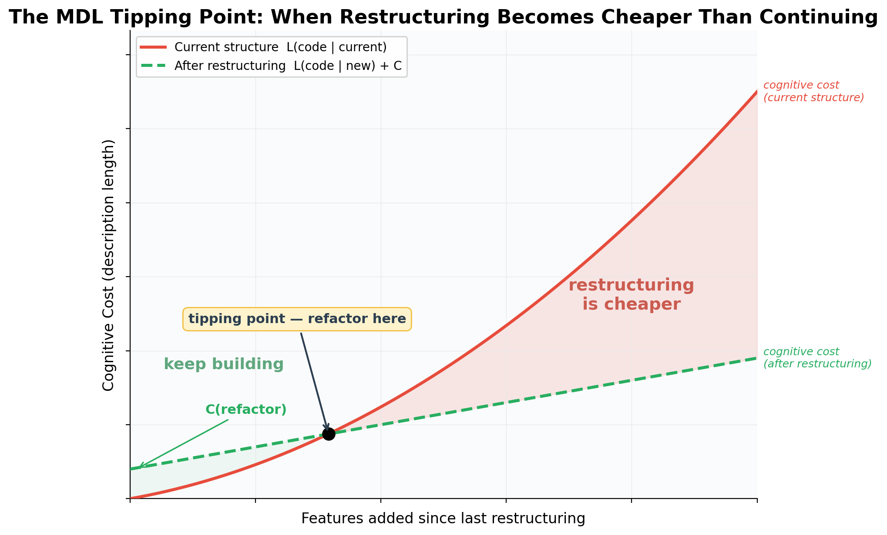
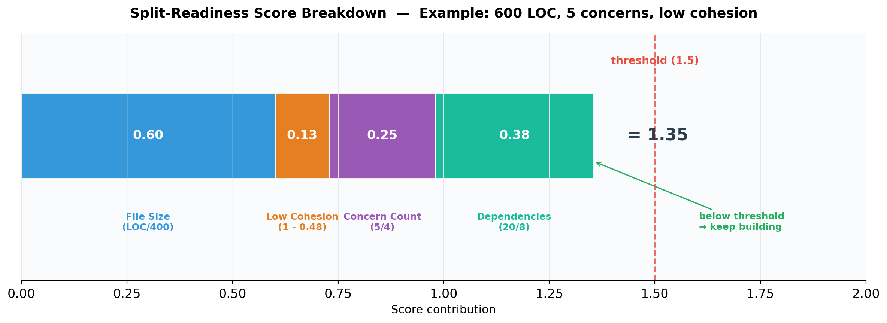
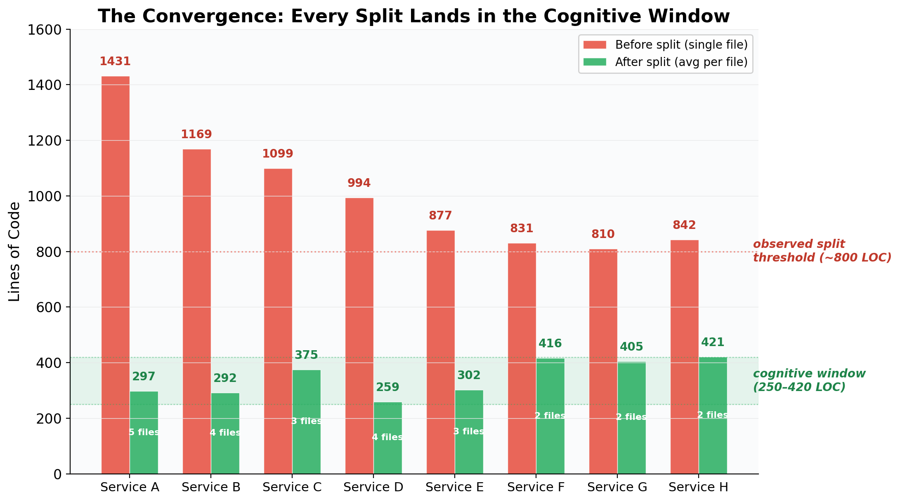

# Refactoring Is Not Heroism — An Information-Theoretic Proof

Every codebase that grows will get messy. This is not a failure of discipline. It is
a mathematical certainty.

Most teams treat this mess as a moral failing. They create "tech debt" tickets that
rot in the backlog. They plan "refactoring sprints" as if cleaning were a special event
that requires permission. They celebrate the developer who finally tackles the mess as
a hero.

This framing is wrong. And information theory has proven why since 1948.

## The Proof Already Exists

A codebase is a compression scheme. The folder structure, the class boundaries, the
module interfaces — these are an encoding that minimizes the description length of
your system. When the encoding fits the content, you can locate any concept with
minimal navigation. Cognitive cost is low.

Shannon proved that a compression scheme is optimized for the data it was built from.
It cannot anticipate data it has never seen. If you could perfectly predict future
features, those features would carry zero information — they wouldn't be new.

Therefore: **every new feature that carries real information will, to some degree,
violate the existing encoding.** The structure was designed for what came before.
The new thing does not fit perfectly. Description length grows.

This is not a failure of your architecture. It is a theorem.

## The Tipping Point Is Calculatable

The Minimum Description Length principle (Rissanen, 1978) gives us the tipping point:

```
Refactor when:  L(code | current_structure) > L(code | new_structure) + C(refactor)
```

Where `L` is description length — the cognitive cost of understanding the code under
a given organizational scheme — and `C` is the cost of restructuring.

Consider a concrete example: your application's state management file. It starts clean
— user authentication state, a few actions, a reducer. Then the next sprint adds
shopping cart state. Then notification preferences. Then a real-time sync layer. Each
addition is small and logical — "it's all state, it belongs here." Six months later
the file is 1,200 lines and four unrelated domains share a single reducer. Changing
the cart logic means scrolling past auth and notification code. A bug in the sync
layer sends you searching through all four concerns because the state shapes are
interleaved.

Now imagine splitting along domain boundaries: four files, each ~300 lines, each
owning its own slice of state. The cost of splitting is real — rewiring imports,
updating tests, one afternoon of focused work. But after the split, every future
change touches one concern, requires one mental model, and risks breaking nothing
outside its boundary.

The formula says: refactor when the ongoing cost of navigating the mess exceeds the
one-time cost of cleaning it up. That crossing point is the tipping point.



Software engineering has been measuring proxies for `L` for decades: cyclomatic
complexity (McCabe, 1976), Halstead volume, coupling metrics (Yourdon & Constantine,
1979). And neuroscience confirmed the biological constraint: fMRI studies show that
**textual size (LOC, token count) is the strongest predictor of brain activation in
working memory regions** — stronger than cyclomatic complexity (Peitek et al., ICSE
2021, Distinguished Paper Award). Human working memory holds approximately 4
independent chunks (Cowan, 2001).

We built a composite formula that combines these signals:

```
S(file) = 0.40 * (LOC / 400) * (avg_cc / baseline_cc)
        + 0.25 * (1 - cohesion)
        + 0.20 * (concerns / 4)
        + 0.15 * (imports / median)
```

Where:
- **400** is the empirical code review effectiveness window (LOC)
- **avg_cc / baseline_cc** is the cyclomatic complexity damper — the average cyclomatic
  complexity per function divided by the codebase median. Simple boilerplate (cc ≈ 1)
  dampens the size signal; deeply nested logic (cc >> baseline) amplifies it
- **cohesion** is semantic similarity between code sections (0-1, measured via embeddings)
- **4** is the working memory chunk limit (Cowan, 2001)
- **imports/median** normalizes dependency fan-out against the codebase



Each weight reflects the research: fMRI data shows file size dominates cognitive load
(0.40), followed by how many unrelated things a file does (cohesion: 0.25, concerns:
0.20), and finally coupling to external modules (0.15).

The cyclomatic complexity factor acts as a damper on the size term, not as an
independent weight. A 600-line file of identical four-line mappings has a cc near 1 —
the damper shrinks its size contribution, and the formula correctly scores it as
harmless. A 400-line file with deeply branching conditionals has a cc well above
baseline — the damper amplifies the size signal, flagging it even though the raw LOC
looks moderate. Size tells you how much code there is. Cyclomatic complexity tells you
how hard each line is to reason about. The damper combines both into a single measure
of cognitive weight.

Cohesion is the other load-bearing term. Without it, the formula cannot distinguish a
large file that does one thing from a large file that does fifteen. Cohesion and the
cc damper serve different purposes: cohesion separates "many concerns" from "one
concern," while cc separates "complex logic" from "simple repetition."

## Testing It Against Reality

We ran this formula against a production codebase: 947 source files across six
microservices.

In a recent cleanup cycle, we split eight service files that had grown too large —
each between 800 and 1,400 lines. No planning, no "refactoring sprint." We felt the
friction and cleaned up. Pure structural refactors: no logic changes, just splitting
along seams that were already visible in the code. Tests passed unchanged — confirming
these were structural moves, not behavioral ones.

When we scored those eight files retroactively using the formula, they all fell above
the tipping point. The formula predicted exactly the splits we had already made by
intuition.

When we scanned the full codebase, 17 files scored above threshold. Eight were the
ones we had just split. Nine were new candidates we hadn't noticed yet — files where
the cost was accumulating but hadn't hurt enough to trigger action.

We then used the formula prospectively: the next scan flagged 10 files above threshold.
We worked through all of them. Eight splits were genuinely valuable — exposing
duplicated logic, mixed read/write concerns, and interleaved domains. Two were false
positives: boilerplate gRPC dispatchers where every method was an identical four-line
delegation. The formula scored them high because of import count and concern count,
but there was no actual complexity to reduce. **80% hit rate on a forward-looking scan,
without the formula having been tuned for this round.**

The false positives had two defenses that both failed. First, missing cohesion data:
the embedding pipeline had silently truncated results, so those files scored with a
default penalty instead of their actual (high) cohesion. Second, the cc damper: those
dispatchers had a cyclomatic complexity near 1 per function — trivial straight-line
delegations. With working cohesion data *and* the cc damper, both files would have
scored well below threshold. Cohesion catches "large but uniform." The cc damper
catches "large but simple." Together they eliminate the class of false positives where
a file is big but harmless.

**A formula with incomplete inputs can give false confidence.** It still beats gut
feeling (which missed nine candidates entirely), but metrics fail silently. You need
to validate the pipeline, not just the math.

The score distribution follows the pattern information theory predicts: a right-skewed
curve with the bulk of files in a healthy range and a thin tail of files accumulating
entropy.



After splitting, file sizes converged to **250-420 lines** — the range where a single
file holds one concern and fits in working memory. This is not a style preference. It
is the point where description length is minimized: small enough to comprehend, large
enough to be self-contained.

## Try It Yourself: FastAPI

To show the formula works beyond our own codebase, we ran it against
[FastAPI](https://github.com/tiangolo/fastapi) — a well-known, well-maintained Python
framework. No tuning, no special configuration. Just:

```
python entropy.py fastapi/ --cohesion auto
```

The `--cohesion auto` flag computes semantic cohesion locally using
[ollama](https://ollama.com) embeddings — no API keys, no cloud, just your machine.
The script splits each file into logical sections, embeds them, and measures how
similar the sections are to each other. High similarity means one concern. Low
similarity means mixed concerns.

Results: 24 files analyzed, 7 above the split threshold.

| Score | File | LOC | CC | Cohesion |
|------:|------|----:|---:|---------:|
| 15.02 | applications.py | 4,036 | 11.9 | 0.63 |
| 10.74 | routing.py | 4,374 | 7.6 | 0.59 |
| 9.36 | param_functions.py | 2,323 | 13.3 | 0.71 |
| 3.05 | dependencies/utils.py | 963 | 6.8 | 0.53 |
| 2.70 | openapi/utils.py | 582 | 11.2 | 0.53 |

The top three files are exactly the kind the formula is designed to catch: thousands
of lines, high cyclomatic complexity, and moderate-to-low cohesion. `applications.py`
alone is 4,036 lines with 41 distinct sections — it carries the entire application
lifecycle, route registration, middleware stack, and OpenAPI generation in a single
file. `routing.py` is even longer at 4,374 lines. These aren't bad code — FastAPI is
a well-engineered project. But entropy accumulates in every codebase, and these files
have crossed the tipping point where splitting would reduce cognitive cost.

The formula also correctly ranks the smaller files low. `concurrency.py` (37 lines,
cohesion 1.0) and `exception_handlers.py` (28 lines, cohesion 1.0) score near zero —
small, focused files that need no attention.

You can reproduce this in under a minute:

```
git clone https://github.com/tiangolo/fastapi
ollama pull nomic-embed-text
python entropy.py fastapi/fastapi --cohesion auto --all
```

## AI Changes the Tempo, Not the Cycle

There is a nuance specific to AI-assisted development that nobody is talking about.

AI can generate code fast. A pair-programming session with an LLM produces more lines
per hour than manual coding. Files grow faster. Features land faster. Entropy
accumulates faster.

But AI can also *read* 800 lines without friction. It doesn't scroll. It doesn't lose
context. So the pain signal — the moment you feel that a file is too large — arrives
later than it should. The human is still the bottleneck for comprehension, but the AI
masks the symptom by handling the navigation invisibly.

Debugging reveals the cost. AI can assist with debugging too — suggesting hypotheses,
reading logs, proposing fixes. But you have to steer it. You have to decide which
hypothesis to pursue, which part of the state to inspect, where the real boundary of
the problem lies. That steering requires understanding the code. The less you
comprehend the structure, the worse your questions become, and the more cycles you
waste chasing the wrong lead. AI amplifies your understanding — it does not replace it.

This creates a gap: the theoretical tipping point (where restructuring is cheaper)
might be at 500 lines, but you don't *feel* it until 800 because your AI partner was
carrying the cognitive load for you. By the time you notice, you've been paying extra
cost for 300 lines.

The entropy cycle doesn't change with AI. The physics is the same. But the tempo
needs to increase — you have to breathe faster because you're running faster. And
you can't rely on your gut to tell you when, because AI dulls the signal. You need
a formula.

## The Threshold Is Not a Line Count

This also reveals an important subtlety: **the threshold is not about file size.**
A 600-line file with high cohesion — all methods serving one concern, all logic
flowing in one direction — should not be split. You would only scatter context that
belongs together, and now you're opening four files to understand one concept.

A 300-line file with low cohesion — three unrelated concerns sharing one file for
historical reasons — should be split immediately.

This is why cohesion is in the formula, not just LOC. The tipping point is the balance
between two costs:

- **Splitting too late:** scrolling, mental overload, holding irrelevant context
- **Splitting too early:** scattered context, jumping between files for one concept

The formula measures both forces. The score rises when a file is large *and*
incoherent. It stays low when a file is large but focused. Size is the strongest
signal, but it is not the only one.

## Why Premature Abstraction Fails (Same Framework)

This framework also explains why over-engineering fails. Premature abstraction is
an attempt to build an encoding scheme for information you do not yet have. By the
MDL principle, an encoding optimized for hypothetical future data will be *worse* for
actual current data than a simple, direct encoding. You pay the complexity cost now
and receive no compression benefit until the predicted data arrives — if it ever does.

## The Rhythm

Growth creates mess. Cleaning resolves mess. These are not opposing forces. They are
two halves of the same cycle. Like breathing.

Resist the mess — refuse to ship anything imperfect — and you never grow. You spend
your energy on abstraction layers that anticipate problems you don't have.

Resist the cleaning — treat refactoring as wasteful — and the mess compounds.
Concerns bleed across file boundaries, dependencies grow implicit, and eventually
every change requires understanding the entire system because no single piece is
self-contained.

The entropy cycle is not a philosophy. It is the information-theoretic consequence of
building systems that do real work. Entropy is not your enemy. It is proof that your
system is alive.

The only question is whether you have a rhythm for managing it.

---

*The formula described in this article is implemented as an open-source Python script
([entropy.py](entropy.py)) that works on any codebase — Python, JS/TS, Go, Rust, Java,
C#, and more. The academic references: Shannon (1948), Rissanen (1978), McCabe (1976),
Halstead (1977), Cowan (2001), Peitek et al. (2021), Sturtevant (2013, MIT).*
