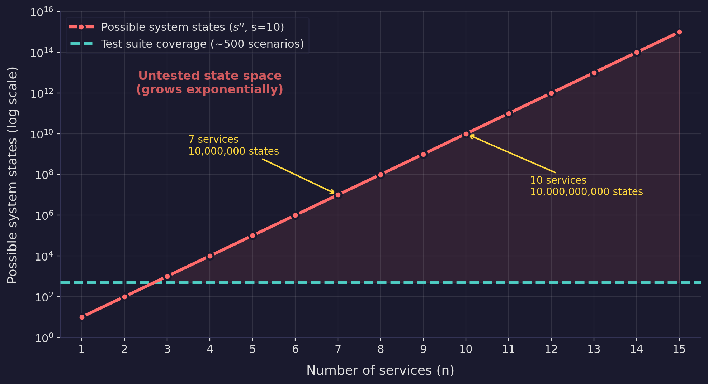
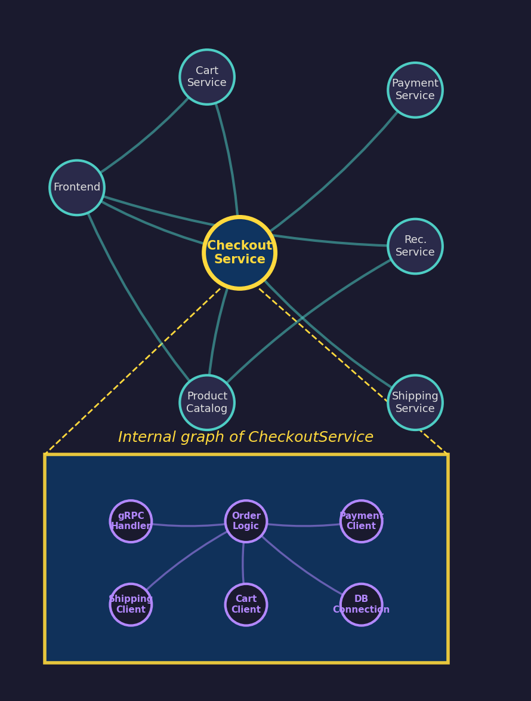
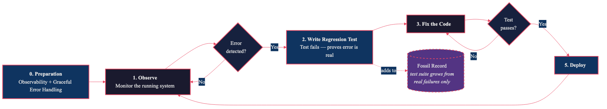

# Observability >> Predictability

Tests are good. Especially well-written tests. Layered tests. Tests that catch real
bugs and give you confidence to ship.

But why are they good? Because they make us feel safe? Because of the green checkmark?

If we write tests before we know all cases, we are trying to **predict behavior.**
This works for closed algorithms — sorting functions, parsers, mathematical
computations — where you can enumerate the inputs and prove correctness on paper. But
does this work for complex distributed systems? Can we grasp all possible outcomes,
all timing-dependent interactions, all failure modes of external dependencies we don't
control?

Everyone honest with themselves would answer "no."

Information theory has an answer ready for us — if we're willing to change the
perspective.

## Prediction Has a Ceiling

A system that is perfectly predictable carries zero Shannon information. If you can
forecast every output from every input, the system tells you nothing new. This is
fine for a space rocket — you design the trajectory on paper, verify it exhaustively,
and launch. There is no second chance to observe and adapt.

But most systems today are not rockets. They are organisms. They grow organically,
absorb new requirements, integrate with third-party services they don't control, and
operate in environments that shift under their feet. The need for fast adaptivity is
growing — and adaptivity requires **new information from the running system.**

Prediction-based testing assumes you can enumerate the relevant behaviors *before*
they happen. For a single pure function, this is tractable. For a distributed system
with n services, each capable of s observable states, the total state space is s^n.

Consider a modest system — something like Google's
[Online Boutique](https://github.com/GoogleCloudPlatform/microservices-demo):
Frontend, CartService, CheckoutService, ProductCatalog, PaymentService,
ShippingService, RecommendationService. Seven microservices, each with 10
meaningful states (healthy, degraded, overloaded, connection pool exhausted, disk
full, DNS timeout, certificate expired, rate limited, version mismatch, and one you
haven't thought of yet).

```
Total state space = 10^7 = 10,000,000 possible system states
```

Note: this assumes a fully connected graph — every service can interact with every
other. A skeptic might object: "But my services aren't all connected to each other."
True. A sparse graph has fewer interaction paths. But sparse connectivity makes the
problem *harder to test*, not easier — because the interactions that do exist are
less obvious, less documented, and more likely to surprise you. A fully connected
graph at least has the virtue of making dependencies explicit. Sparse graphs hide
them.

Your test suite samples from this space. Even an excellent integration test suite
might cover a few hundred scenarios. That is 0.001% of the state space — and this is
a *small* system. Add an external payment provider and a message broker and you're
at 10^9.



This is not a limitation of your test framework. It is a combinatorial wall.

## The Graph Inside the Graph

But s^n is still optimistic. It treats each service as a single node with s states.
In reality, each service is *itself* a graph. Take CheckoutService: it has a gRPC
handler, order logic, payment client, shipping client, cart client, and a database
connection — each with their own states. The payment client can be healthy, timed
out, or rate-limited. The DB connection pool can be full, degraded, or recovering.
The gRPC handler can be backpressured. These internal states compose.

If each service has m internal components, each with s_i states, then the internal
state space of one service is already s_i^m. The total system state space becomes:

```
(s_internal^m)^n = s_internal^(m·n)
```

This is not merely exponential. It is the composition of two exponentials — the
internal complexity of each node multiplied across the inter-service graph. A system
of 7 services, each with 6 internal components, each with 5 states:

```
5^(6·7) = 5^42 ≈ 2.3 × 10^29 possible system states
```

Your test suite covers a few hundred of these. The ratio is not even worth computing.

This fractal structure is why integration tests that mock service internals fail in
production. You tested the service-to-service interaction, but the failure happened
*inside* a service — a connection pool that exhausted under load, a cache that
expired at the wrong moment, a retry loop that amplified instead of dampened. The
graph inside the graph is where the surprises live.



## The Black Box Problem

There is another dimension prediction cannot reach: **dependencies you do not
control.** Every non-trivial system mocks external services — Stripe, AWS, Auth0,
PostgreSQL. But a mock is a **model of the dependency, not the dependency itself.**
When Stripe changes an error format or adds a rate limit you didn't know about,
your mock still returns the old behavior. Test passes. Production breaks.

You cannot predict the behavior of a system you don't own. Observation is the only
strategy that works for black boxes: watch what the dependency *actually does* and
react to what you learn.

## The Verification Recursion

If your tests are complex enough to verify a complex system, they are complex enough
to contain bugs themselves. A buggy test is **worse than no test** — it gives false
confidence while making your model less accurate.

So you verify your tests. But the verifier can have bugs too:

```
test(system)           — does the system work?
test(test(system))     — does the test correctly verify the system?
test(test(test(...)))  — turtles all the way down
```

This is not just an engineering inconvenience — it has a formal name. **Rice's
theorem** (1953) proves that any non-trivial semantic property of a program is
undecidable. Applied here: the question "does this test correctly verify this
system?" has no general algorithmic answer. The recursion has no termination
condition.

In practice: tests that pass for months while the bug they were supposed to catch
has been present all along. We measured this in our own codebase — when generating
tests at scale, roughly 19% ended up superficial, inflating coverage metrics without
catching real bugs.

## Observation Breaks the Recursion

What if we flip the direction?

Instead of predicting what might go wrong and writing tests to prevent it, we
**observe what actually goes wrong and write tests to prevent it from recurring.**

This is Observation-Driven Testing (ODT):

```
procedure ODT(system)
    require: observability(system) ≥ threshold
    require: error_handling(system) = graceful

    loop
        observe(system)
        if error detected then
            test ← write_regression_test(error)
            assert test.fails()                -- proves error is real, not transient
            repeat
                fix(code, error)
            until test.passes()
            deploy(system)
        end if
    end loop
end procedure
```



Notice what this buys you:

**No verification recursion.** The error you observed is real — it happened in
production or staging, not in your imagination. The regression test proves the error
exists (it fails before the fix). The fix makes it pass. The test is grounded in
reality, not in a prediction about reality. There is no need for "tests for tests"
because the system itself was the oracle.

**No state space explosion.** You don't need to enumerate all possible states. You
only need to cover the paths that *actually execute and fail.* The running system
samples the state space for you — and it samples the states that matter, weighted by
actual usage patterns.

**No black box blindness.** When a dependency misbehaves — a payment provider changes
an error format, a database behaves differently under load — observation catches it
immediately. You don't need to predict what Stripe might do. You see what Stripe
*did* do.

**No false confidence.** Every test in the suite corresponds to a real failure that
really happened. The test suite is a **fossil record** of your system's actual
failure modes — not a prediction of hypothetical ones.

## Where TDD Still Wins

This is not a blanket rejection of TDD. There are domains where prediction works:

- **Pure algorithms.** Sorting, parsing, cryptographic primitives — where the state
  space is bounded and you can prove correctness. Write tests first. Prove them on
  paper.
- **Contract boundaries.** API schemas, protocol buffers, serialization formats —
  where the specification is the test. Write them first.
- **Safety-critical systems.** Avionics, medical devices, nuclear control — where the
  cost of observation (a crash, a death) is unacceptable. Predict exhaustively.

The dividing line is **whether you can enumerate the relevant state space.** If yes,
predict. If no — and for most distributed systems the answer is no — observe.

## The Plant and the Blueprint

Premature prediction is what blocks most of the good stuff in the real world.

A plant starts growing from a small seed. It does not plan where to place its roots.
It grows a root tip, encounters a rock, turns. Encounters water, branches. The root
system is optimized for the *actual* soil — not for a predicted soil model that was
wrong about the rock at 30 centimeters.

We already have this loop in many places: CI/CD is observation-driven deployment.
Feature flags are observation-driven rollout. A/B testing is observation-driven
product design. Canary releases are observation-driven reliability.

Why not put the same loop into our testing philosophy?

## Why Observation Scales and Prediction Doesn't

The formal argument rests on three results: state space explosion is PSPACE-complete
(Clarke et al., 1986) — provably intractable for concurrent systems. Rice's theorem
(1953) makes the verification recursion undecidable. And black box opacity follows
from definition — you cannot test what you cannot see inside.

Together:

- **Prediction-based testing** scales with the *potential* complexity of the system —
  exponentially compounding, unverifiable, blind to black boxes.
- **Observation-based testing** scales with the *realized* complexity — only actual
  execution paths, including real dependency behavior. Real workloads follow
  power-law distributions: a few paths carry most of the traffic.

## AI Changes the Testing Philosophy, Not the Math

AI can generate tests faster than humans. An LLM can read a function and produce
dozens of test cases in seconds. This sounds like it solves the state space problem.

It doesn't. AI generates tests based on patterns — what *looks like* it should be
tested, based on the training distribution of tests it has seen. It is still
prediction, just faster prediction. The combinatorial wall doesn't care how quickly
you sample — 0.01% sampled in one second is still 0.01%.

Where AI genuinely helps is in the ODT loop:

- **Observing:** AI can process traces, correlate logs, and detect anomalies across
  services faster than any human
- **Writing regression tests:** given an observed failure, AI can draft the test in
  seconds
- **Analyzing patterns:** AI can spot recurring failure modes across incidents and
  suggest structural fixes

AI accelerates the observation cycle. It does not make prediction viable for complex
systems.

## Cookbook: ODT in Practice

Here is how you can start today. No rewrite, no migration. Five steps.

### 1. Pick an observability stack

You need three things: metrics, logs, and traces. Grafana + Prometheus + Loki +
Tempo is a common open-source stack. Datadog, Honeycomb, or any APM will work too.
The point is not which tool — the point is that you can see what your system does
when it runs.

If you have nothing yet, start with Grafana Cloud's free tier. You can instrument
one service in an afternoon.

### 2. Instrument one critical flow

Don't instrument everything. Pick the flow that matters most — checkout, onboarding,
the API your biggest customer calls. Add structured logging at decision points. Add
traces that span service boundaries. Add a dashboard that shows the flow's health.

If you already have an application running, decorate the existing flow. OpenTelemetry
auto-instrumentation gets you 80% of the way without touching business logic.

### 3. Build an agent harness

This is the part that changes everything. Instead of writing test cases by hand,
let an AI agent explore your application the way a real user would.

Set up a pipeline that runs an LLM with [Playwright](https://playwright.dev/).
Give the agent a persona — not a test script. A persona has intent, context, and
emotion:

> *"You are a first-time user who just signed up. You want to buy a product but
> you're impatient — if something takes more than a few seconds, you click away
> and try a different path. You don't read instructions."*

> *"You are an experienced power user. You know every keyboard shortcut. You open
> multiple tabs. You do things fast and expect the system to keep up."*

> *"You are frustrated. Your last order was wrong. You're looking for support but
> you can't find it, so you start clicking everything."*

Each persona explores a different region of the state space. The impatient user
finds timeout issues. The power user finds race conditions. The frustrated user
finds broken navigation flows. None of these would appear in a test suite written
by a developer who knows exactly where every button is.

### 4. Correlate agent sessions with traces

This is where the observability stack earns its keep. Each Playwright session gets
a trace ID. That trace ID propagates through your services. When the agent clicks
and something breaks — a 500, a timeout, a UI that hangs — you can see exactly what
happened inside your system: which service failed, which query was slow, which retry
loop amplified the problem.

Add the agent sessions themselves to your observability stack. Now you have a
dashboard that shows: this persona, this flow, this failure, this trace.

### 5. Write regression tests only for what broke

When the agent finds a real failure — not a flaky assertion, not a predicted edge
case, but something that actually broke in the running system — write a regression
test. The test fails before the fix. The fix makes it pass. The test joins your
suite as a fossil: proof that this failure happened and cannot happen again.

Your test suite grows from reality, not imagination. Every test has a story. None
are speculative.

---

This is the ODT loop made concrete. The AI agent is not predicting what might go
wrong — it is generating realistic traffic that your system must handle. The
observability stack watches what actually happens. You only write tests for what
actually fails. The system teaches you what to test.

## The Rhythm (Continued)

The first article showed that entropy is inevitable — every growing system
accumulates structural disorder. The answer is not to prevent the disorder but to
have a rhythm for resolving it: the refactoring cycle.

This article shows the same principle applied to correctness: you cannot predict all
failures in a complex system. The answer is not to test harder but to observe better
and let the system teach you what to test.

Prediction assumes you know the answer before the question is asked. Observation
assumes you don't — and builds the infrastructure to learn fast when the question
arrives.

The entropy cycle is breathing. Observation-driven testing is listening. Both are
rhythms that keep a system alive.

---

*The formal foundations: Shannon (1948), Rice (1953), Clarke, Emerson & Sistla (1986).
The philosophy builds on Charity Majors' Observability-Driven Development (ODD),
Netflix's testing-in-production practices, and chaos engineering principles — but
formalizes the feedback loop as an algorithm rather than a mindset. The practical
observations are from a production microservices system where 19% of auto-generated
tests were found to be superficial — inflating coverage without catching real bugs.*
