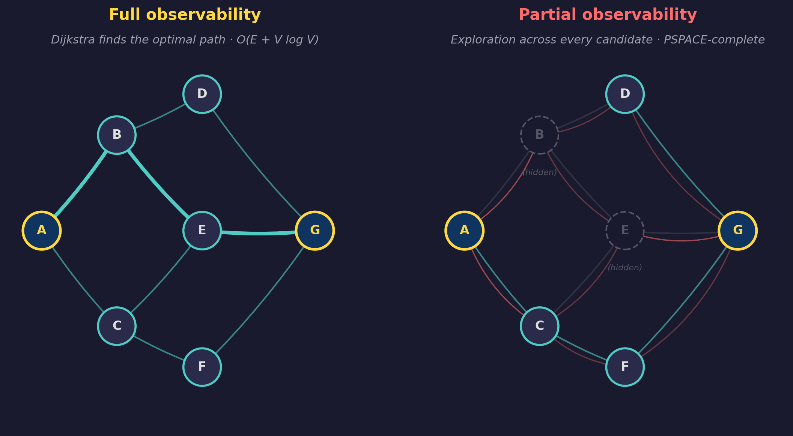
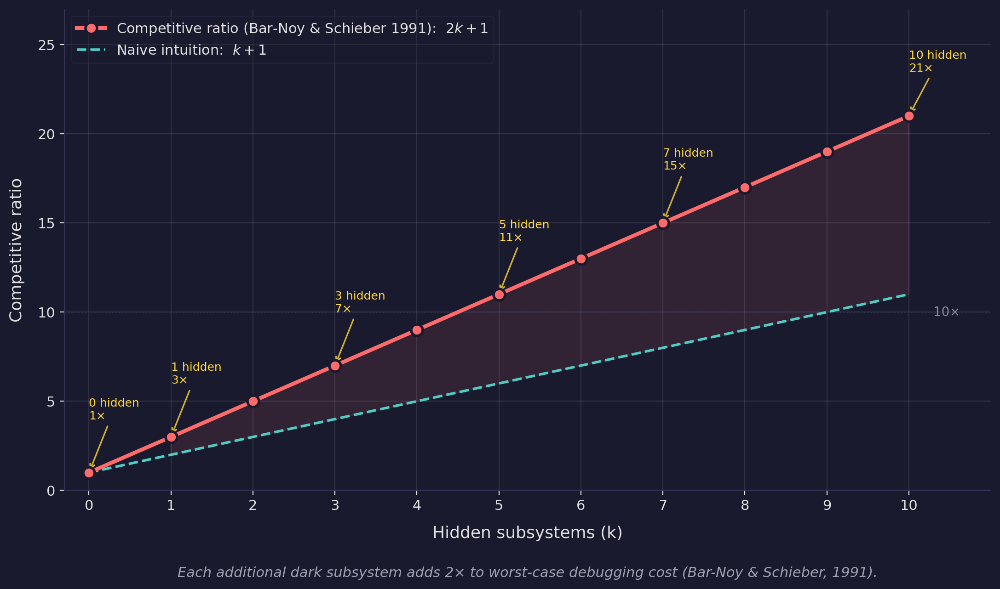

# The Observability Tax — A Graph-Theoretic Proof

Every engineer has lived this: a request fails, you open your tracing dashboard, you
see the full path from ingress to database, and you find the broken node in two minutes.
The same week, a different request fails in a service with no tracing. You add a log
line. Redeploy. Wait. Check. Wrong service. Add another log line. Redeploy. Wait. Three
hours later you find a timeout in a dependency you didn't know existed.

Two minutes versus three hours. Same class of bug. The only difference was visibility.

This gap is not anecdotal. It is a consequence of graph theory, and the proof has
existed since 1991.



## Debugging Is Graph Search

A distributed system is a directed weighted graph. Nodes are services, functions,
components. Edges are requests, data flows, dependencies. Edge weights are time — the
latency, processing cost, or probability of failure along each path.

When a request fails, debugging is pathfinding: you need to find the shortest path
from the symptom (A) to the root cause (B) through this graph.

With full observability — traces, metrics, logs at every node — you have the complete
graph. Every node is visible. Every edge weight is known. Finding the shortest path is
a solved problem: Dijkstra's algorithm runs in O((V + E) log V). You open the trace,
follow the span waterfall, find the slow or failing node. Done.

Now black out part of the graph. Remove the traces from two services. Drop the metrics
from a database. Lose the logs from a message broker. The nodes still exist — requests
still flow through them — but you cannot see them. Their outgoing edges are invisible.
Their weights are unknown.

You can no longer compute the shortest path from symptom to cause. You must explore.

## The Proof Already Exists

This problem has a name: the **Canadian Traveller Problem** (Papadimitriou &
Yannakakis, 1991). A traveller must navigate from A to B in a graph where some edges
may be blocked — but the traveller only discovers a blockage upon arriving at a node.
The question: how much more expensive is the journey compared to a traveller with full
knowledge?

Papadimitriou and Yannakakis proved that this problem is **PSPACE-complete** — it
sits in a complexity class where a polynomial-time algorithm would force
P = NP (since NP ⊆ PSPACE, any polynomial solution to a PSPACE-complete
problem forces P = PSPACE, which in turn forces P = NP). No one has proven
that impossible, but half a century of failed attempts is the
strongest circumstantial evidence theoretical computer science has. So
while we cannot say an efficient algorithm for navigating a partially hidden
graph is *provably* excluded, we can say it would overturn the central open
problem of the field.

For software observability, the implication is direct: **debugging a system with hidden
components is not merely harder than debugging a fully visible one. It belongs to a
fundamentally harder complexity class.**

The gap between "I can see everything" and "some parts are dark" is not a matter of
inconvenience. It is a phase transition in computational difficulty.

## The Competitive Ratio

Competitive analysis (Sleator & Tarjan, 1985) gives us the precise measure. The
**competitive ratio** is the worst-case cost of an online algorithm (partial knowledge)
divided by the offline optimal (full knowledge):

```
competitive_ratio = cost(exploration) / cost(optimal_path)
```

For the Canadian Traveller Problem with k hidden edges, the competitive ratio
reaches **2k + 1** in the worst case (Bar-Noy & Schieber, 1991). That is linear
in k: each additional hidden subsystem adds 2 to the worst-case ratio.

Consider what this means for a debugging session:

| Hidden nodes | Competitive ratio (worst case) | Interpretation |
|:---:|:---:|---|
| 0 | 1 | Optimal. You see everything. |
| 1 | 3 | One dark service triples worst-case cost. |
| 2 | 5 | Two dark services: 5x. |
| 3 | 7 | Three: 7x. |
| 5 | 11 | Five: 11x. |
| 7 | 15 | Seven: 15x. |
| 10 | 21 | Ten: 21x. |



These are worst-case bounds, not typical cases. The competitive ratio is linear in k
— but the coefficient matters. With k hidden subsystems, the search space contains up
to 2^k possible failure combinations. Finding the *optimal* strategy through that
space is what Papadimitriou & Yannakakis proved PSPACE-complete: computationally
intractable in the general case. Bar-Noy & Schieber's 2k+1 is the tight bound for the best
deterministic online algorithm against that space.

At k=7 — seven dark top-level subsystems — the worst-case debugging cost is 15×
that of a fully visible system. Not a hockey stick, but not ignorable: **each
additional uninstrumented subsystem adds two worst-case debugging cycles.** You
cannot prune a hidden node. You cannot rule it out. You must visit it.

## Why Exploration Is So Expensive

In a fully visible graph, Dijkstra prunes aggressively. When you see that service C
has 2ms latency and service D has 800ms, you never explore C further for a timeout
bug. The visibility lets you eliminate branches instantly.

In a partially hidden graph, you lose the ability to prune. A hidden node might be
the bottleneck — or it might be perfectly healthy. You cannot know without visiting
it. And "visiting" a hidden node in software debugging splits into two cases, both
expensive — the second far worse than the first.

**Case A — you can redeploy.** If you have fast CI/CD, a staging environment
that reproduces the failure, and permission to ship instrumentation on demand,
then each exploration step has a fixed cost floor:

- **Instrument:** add a log line, trace span, or metric (minutes)
- **Deploy:** push the change through CI/CD (minutes to hours)
- **Wait:** the failure may be intermittent (minutes to days)
- **Analyze:** read the new data, determine if this node is the cause (minutes)
- **Repeat:** if not, move to the next candidate

When the competitive ratio says 11x (k=5 hidden subsystems), it means 11 of these cycles in the worst case.

**Case B — you can't.** Plenty of teams don't have that luxury. The service
is a vendored binary, the deployment window is weekly, production writes aren't
reproducible in staging, or change control means an instrumentation PR takes a
week to merge. In that case you cannot visit the hidden node at all — you
have to **assume** what it does and act on the assumption. This is not
Dijkstra visiting a node in O(1); it is not even the slow human-in-the-loop
exploration of Case A. It is debugging by hypothesis, where wrong guesses
compound and the feedback loop that would correct them is closed. The cost
here is unbounded: some incidents are simply never root-caused, and the team
absorbs the unresolved risk as technical debt.

A fully observed system pays neither cost. The trace already has the answer.

## The Two Regimes

This creates two qualitatively different debugging regimes:

**Regime 1: Full observability (polynomial).** The graph is complete. Pathfinding is
mechanical. You open traces, follow the request, find the anomaly. The cost scales
with the size of the system (more nodes = longer traces) but remains tractable. A
10-service system with full tracing takes marginally longer to debug than a 5-service
one.

**Regime 2: Partial observability (PSPACE).** Some nodes are dark. Pathfinding
becomes exploration. The cost scales with the number of *hidden* nodes at 2k+1 per
the Bar-Noy & Schieber bound, and finding the optimal exploration strategy is
PSPACE-complete. A system with 5 uninstrumented services out of 10 is not 50%
harder to debug — it is 11× harder in the worst case.

The boundary between these regimes is sharp. You are either in one or the other. There
is no "mostly observable" — either you can compute the path or you must explore it.
This is why partial observability feels so much worse than its coverage percentage
suggests: 90% instrumentation is not 90% of the benefit. It can be closer to 50%, or
less, depending on which 10% is missing.

## Testing Against Reality

Six of the services running in our production cluster form a closed request chain —
every call between them is internal, and we instrument the whole chain: distributed
traces (OpenTelemetry), structured logs (Loki), metrics (Prometheus). Every request
carries a trace ID through all six hops. Every service emits structured logs
correlated to that trace. Every pod reports resource metrics.

When something breaks in this environment, the diagnosis pattern is consistent:

1. Alert fires (Grafana)
2. Open traces for the failing endpoint
3. Follow the span waterfall to the slow or erroring service
4. Read the correlated logs for that service
5. Identify the root cause

Time: **2-15 minutes** for the vast majority of incidents. The graph is fully visible.
Dijkstra works.

Now consider what happens when a component falls outside our instrumentation — an
external API, a DNS resolution path, a kernel-level network timeout, a dependency
we haven't wrapped with tracing:

1. Alert fires
2. Open traces — the span stops at the last instrumented service
3. The trace says "this call took 30 seconds" but not *why*
4. Hypothesis: is it the external API? The network? DNS? A kernel setting?
5. Add logging at the boundary. Redeploy. Wait for recurrence.
6. New data narrows it to the network layer. But which part?
7. Add packet captures. Analyze. Find the actual path.
8. Root cause identified.

Time: **1-6 hours.** Same class of bug (a timeout). Same team. Same tools. The only
difference: a few hidden nodes in the graph.

The ratio between these two cases — 15 minutes vs 3 hours — is 12×. Consistent with
the competitive ratio for 5-6 hidden nodes (2k+1 gives 11–13×). The math predicts
reality.

## The Dual of Article 02: Why Service Boundaries Bite Hardest

The [previous article](../02-observability-principle/02-observability-principle.md)
argued that you cannot predict the state space of a distributed system; you must
observe it. This article is the dual: *once you commit to observing, the gaps
compound.* The two are the same lesson from opposite sides of the telescope —
[article 02](../02-observability-principle/02-observability-principle.md)
says prediction fails because the space is too large, this one says partial
capture fails because each additional dark subsystem adds two more worst-case
debugging cycles and the space of failure hypotheses grows as 2^k.

The two arguments compound at service boundaries. A request that crosses a
gRPC boundary, a message queue, or an external API is exactly where hidden
nodes accumulate: each unlogged hop adds to `k` in the competitive ratio.
There is a discipline-based solution, and it is now well-trodden in the
industry: **pipeline the observability context along with the request
itself.** A request entering the system acquires a trace context at the edge,
and every downstream call (gRPC metadata, message headers, DB span) propagates
that context through shared middleware. No service can be a hidden node
because it opted out — the plumbing is centralized. Pipelining observability
is the dual of pipelining the request: they travel together, or the graph
goes dark.

Our own system applies this pattern uniformly across a dozen internal service
surfaces. A request enters through a gateway, picks up a correlation ID and
an OpenTelemetry context, and that context rides every subsequent hop without
the author of any individual service having to think about it. The effect on
the competitive ratio is immediate: `k` across service boundaries stays at
zero, because the plumbing makes opting out harder than opting in. Request
pipelining is common; pipelining the *observability* of those requests is the
move that keeps the graph whole.

## AI Changes the Search, Not the Graph

AI debugging assistants (including the one co-writing this article) can help explore
a partially visible graph faster. They can suggest hypotheses, correlate logs across
services, propose instrumentation points, and draft the deploy-test-analyze cycle
more quickly.

But they cannot see hidden nodes any better than you can. AI operates on the same
graph you have. If a service emits no telemetry, no model — however capable — can
infer what happened inside it. AI accelerates the exploration loop, but it does not
change the complexity class. A 15× exploration cost (k=7) becomes perhaps 5× with AI
assistance. Still a significant multiplier. Still fundamentally harder than the
polynomial case of full visibility.

The real leverage of AI in debugging is not in the partial-observability regime. It
is in making the full-observability regime even faster — processing traces that would
take a human 10 minutes in 30 seconds, correlating signals across dashboards
instantly, catching patterns across historical incidents. AI makes Dijkstra run
faster. It does not make exploration unnecessary.

This is the same insight as the entropy cycle: AI changes the tempo, not the physics.

## The Practical Implication

Observability is typically sold as a quality-of-life improvement. "Better dashboards."
"Faster debugging." "More confidence." These are true but miss the structural argument.

The graph-theoretic framing reveals something stronger: **observability is the
difference between polynomial and PSPACE debugging cost.** The competitive ratio
grows at 2k+1 per hidden subsystem — linear in k, but with a multiplier of 2. The
decision problem of navigating optimally is PSPACE-complete. It is a phase transition.

This has direct consequences for how teams should invest:

**Coverage matters more than depth.** A shallow trace across all services (polynomial
regime) beats deep instrumentation of half the services (PSPACE regime for the
other half). The competitive ratio is driven by the number of *hidden* nodes, not the
quality of instrumentation on visible ones.

**The last 10% is the most valuable.** Standard observability advice focuses on the
most critical services. The graph theory says the opposite: the services you haven't
instrumented are the ones that will cost you the most. Each dark subsystem adds 2 to
your worst-case debugging multiplier — the hidden nodes are where the cost compounds.

**Observability has a calculable ROI.** If your mean time to resolution (MTTR) for
fully-traced incidents is T, and for partially-traced incidents is kT, then the cost
of missing observability is (k-1)T per incident. Multiplied by incident frequency,
this is a dollar amount. The competitive ratio gives you k — that is, k = 2 × (hidden
subsystems) + 1, not the raw node count.

## A Companion Tool — Making the Tax Measurable

The [first article](../01-entropy-cycle/01-entropy-cycle.md) shipped with
[`entropy.py`](../01-entropy-cycle/entropy.py), a CLI that turns the
entropy-cycle thesis into a number per file. This article has its counterpart:
[`observability.py`](observability.py) — same language coverage (Python, Go,
Rust, Java, C#, C/C++, JS/TS, Ruby, PHP), same CSV/table output style, but it
measures the observability tax instead of split-readiness.

The formula mirrors the article's thesis:

```
ICR(f) = 0.40 · log₂(1 + branches)      # decision entropy (McCabe → Shannon)
       + 0.35 · log₂(1 + mutations)     # state delta per call
       + 0.25 · log₂(1 + external_calls) # boundary crossings

CCR(f) = (logs + spans + metrics) / functions

coverage(f) = min(CCR(f) / ICR(f), 1)
gap(f)      = ICR(f) · (1 − coverage(f))
```

At the system level the tool reports `k` — the number of top-level directories
where at least half of the ICR sits in files below the coverage threshold — as
a proxy for hidden *services*. That single integer feeds the worst-case
competitive ratio `2k + 1` directly, turning the article's table into a
command you run against your own repo.

A naive per-file scan is honest about gaps but unfair to services that
instrument *at the pipeline layer* rather than in every handler — the
"unified request flow" pattern from the previous section. A mediator,
middleware, or interceptor that emits a span once on entry and once on exit
covers every handler that flows through it, even if the handler files
themselves contain zero logging calls. A file-level tool counts those
handlers as dark; the request graph sees them as fully observed.

The tool accepts a small config file,
[`.observability.json`](examples/.observability.json.example), that lets
you declare these pipelines explicitly:

```json
{
  "pipelines": [{
    "name": "mediator",
    "sources": ["Core/Mediator/Mediator.cs",
                "Core/ExecutionStrategies/BaseExecutionStrategy.cs"],
    "covers": ["**/UserStories/**/*.cs", "**/Handler/**/*.cs"]
  }]
}
```

To stop the config from becoming a rubber stamp ("we have a pipeline, trust
us"), the tool runs a **trust check**: for each declared pipeline it
measures the source files' own coverage. If the sources don't meet the
coverage threshold themselves, the pipeline is rejected — no credit flows
to the files it claims to cover. This makes the claim falsifiable: if
someone removes the instrumentation from `BaseExecutionStrategy.cs`, the
pipeline fails validation on the next scan, and all the files it was
covering re-emerge as gaps.

The tool is still a heuristic — regex pattern
detection plus declared pipelines — and the output is a conversation
starter, not an audit report. But with a pipeline declaration, the
conversation can start from the right premise: *what does our
architecture claim about where observability lives, and does that claim
survive a grep?*

## The Rhythm (Again)

The [first article](../01-entropy-cycle/01-entropy-cycle.md) showed that entropy
growth is mathematically inevitable in any system that does real work. The
[second](../02-observability-principle/02-observability-principle.md) showed that
prediction-based testing cannot keep up with that complexity — you must observe
rather than predict.

This article provides the mathematical grounding of *why* observation wins: each
additional dark subsystem adds 2 to the worst-case debugging multiplier, and the
problem of navigating optimally through a partially-observable graph is PSPACE-complete.
The question is not whether you will have incidents, but whether your graph is
complete enough to resolve them in polynomial time.

All three are the same principle, applied to different dimensions: **you cannot
prevent the problems that come from building real systems. You can only ensure you
have the structure to resolve them efficiently.**

Entropy is managed by the refactoring cycle. Testing is managed by observation, not
prediction. Debugging cost is managed by observability coverage. All three require
continuous investment, not heroic sprints. All three have a mathematical reason why
neglect compounds faster than intuition suggests.

The entropy cycle is breathing. Observation-driven testing is listening. Observability
is sight. You need all three to stay alive.

---

*The mathematical foundations: Papadimitriou & Yannakakis (1991), Sleator & Tarjan
(1985), Bar-Noy & Schieber (1991), Dijkstra (1959). The practical examples are from
a production Kubernetes cluster running distributed tracing via OpenTelemetry, logging
via Loki, and metrics via Prometheus.*
