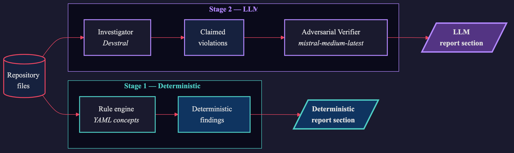

# The Drift Scanner — Why Repositories Disagree at the Seams

Open the `AGENTS.md` at the root of any mature open-source monorepo and
the concrete claims — the build command, the package manager, the
directory layout — are almost always correct. Every contributor who
opens a pull request reads that file. Every reviewer has it loaded. A
stale claim on the front page of a well-trafficked repository is not a
problem that persists, because the moment it appears somebody corrects
it.

Now go six directories deep, into a team-owned agent doc nested under
a CLI extension or a UI component, and the picture changes. These are
files that one team wrote, once, and no reviewer has scrolled since.
We ran a drift scanner across ten public AI-adjacent repositories and
every drift finding worth reporting lived in a file like that. Zero
drift in the root-level docs. Stale claims only in the nested ones.

The drift was not distributed by repository quality. It was distributed
by **reader density**. That is the only useful generalisation the
benchmark produced, and it is the one the rest of this article is
about.

## Reader Density, Not Repository Size

Drift is the accumulated disagreement between parts of a repository
that ought to agree: the prose that cites a function name, the
function the name was renamed to, and the handler that still behaves
the old way. It is not a bug in any single file. It is a disagreement
between two files about what is true.

Most tools cannot see drift, because seeing it requires reading
*intent*. A linter verifies that a file is internally consistent with
the grammar of its language. A compiler verifies that a program type-
checks. Neither has anything to say about whether the sentence two
directories up still describes the code it refers to, because the
sentence is not code. It is intent written down, and verifying intent
against implementation is a judgement call.

Where that judgement call gets made many times, drift does not
accumulate. A PR against a popular repository's root `AGENTS.md` is
reviewed by contributors who treat the file as a spec. Stale claims are
caught the same way stale API signatures are — by the reader tripping
over them.

Where the judgement call is made once and then not again, drift grows.
Nested agent-facing docs that one sub-team owns. Conventions written
into a private `AGENTS.md` that only the engineers who authored it ever
open. Contracts between two repositories maintained by two teams, where
no reviewer sees both sides at once. These are the seams. The benchmark
surfaced them because the hypothesis predicted they were where the
failures would be.

Reader density is the simplest possible proxy for this: how many
distinct people have read a file and had reason to correct it —
measurable as unique authors in git history or PR touches in the last
year. Where density is high, errors surface quickly. Where density
approaches one, errors age in place.

When the primary reader of a repository shifts from human to agent, the
cost of drift changes. A human reader brings prior knowledge,
skepticism, and the ability to sense that a doc is probably stale. An
LLM agent is more likely to act on stale context — and does so at
higher volume and with less hesitation. A stale reference becomes a
factual claim it acts on without a second opinion. A contradictory
convention becomes a coin flip. Drift on a seam that used to be
cosmetic becomes load-bearing.

## The Scanner as Two-Stage Measurement

Constantia splits the work into two halves that correspond to what
each technology is actually good at.

**Stage 1 — deterministic selection.** A guided rule engine
enumerates the repository against a set of YAML-encoded *concepts*. A
concept is a single declarative claim about what the repository is
supposed to look like — for example, "every proto RPC has a handler
for its request type," or "every cited file path in a markdown
document refers to a file that exists." The engine walks the
filesystem, resolves references, and emits a set of candidate
findings. This is cheap and reproducible; it cannot hallucinate. What
it cannot do is judge nuance. A cited path that doesn't exist might be
legitimately stale, or it might be a symbolic placeholder like
`<repo>` that was never meant to resolve. The deterministic layer
finds the candidates; it does not pass sentence.

**Stage 2 — LLM investigation.** The harder concepts — the ones that
require reading a block of code and deciding whether it *conforms to
an intent* — are routed to an LLM investigator. The investigator
receives the concept's stated principle, a selection of canonical and
violating peer examples, and the file under inspection. It returns one
of four verdicts per claim in the file: *fit*, *violation*,
*uncertain*, or *not applicable*. A second LLM pass — the adversarial
verifier — re-reads each claimed violation and tries to defeat it.
Only findings that survive the adversary make it into the report.

The design follows a rule that took some scars to learn: **LLM
findings and deterministic findings must never be mixed in the
output.** Each has its own section. Each has its own content hash. A
reader who trusts only the deterministic layer can ignore the LLM
section entirely and still get a cheap, reliable drift signal. A
reader who wants the richer picture can consult both. Mixing them
contaminates both: a single hallucinated claim buried in a list of
grep-level truths poisons the credibility of the whole list.



## Why Two Models, and Which Ones

The investigator and the verifier are not the same model. Redundant
components only catch errors if their failure modes differ; confirming
yourself is not verification.

The investigator runs on **Devstral**[^1] (Mistral's code-tuned
model), specialized for bulk source-code reading. The verifier runs on **`mistral-medium-latest`** — a different
specialization and a different prompt surface. Not fully decorrelated
(both models share a vendor and training lineage), but differentiated
enough that a code-specialist reader paired with a generalist skeptic
catches the investigator's tendency to over-index on surface pattern
similarity. In the runs described here, the verifier dropped confident
investigator findings that on close reading reflected pattern matching
rather than real violations — evidence the two-stage design earns its
compute.

The choice of Mistral was practical: EU-hosted models (relevant for
GDPR-covered repositories), sane per-call pricing, and Devstral's
specific tuning for code reading. The important architectural choice
was *two differently-specialised models*, not *which vendor*. The
runner is **goose** (`block/goose`), Block's open-source agent CLI —
its YAML recipe files keep prompt configuration as *data* rather than
code, reviewable in isolation, swappable without touching Python.
Recipe files, concept schemas, and full configuration are in the
[constantia repository](https://github.com/HeinrichvH/constantia).

## The Concept File Is the Interesting Artifact

The concepts themselves are written in a small YAML dialect:

```yaml
- id: grpc-request-base-forwarding
  name: GrpcRequestBase forwarding
  principle: |
    When a gRPC handler issues a downstream call, it reuses the
    incoming request.Base (preserving userId, trace, locale, and
    organization_id). It does NOT fabricate a new GrpcRequestBase
    populated only with correlationId.
  rationale: |
    Fabricated bases silently drop identity, tracing, and locale.
```

This file — not the scanner code — is the real payload: the team's
written agreement with itself, made machine-readable. The convention
being enforced is semantic, not syntactic. You cannot regex your way
into detecting "this handler fabricates a base." You can explain the
convention to a capable model with a handful of canonical examples and
let it judge. The full concept set from this benchmark is in the
[`examples/` directory](https://github.com/HeinrichvH/constantia/tree/main/examples).

## What the Benchmark Actually Showed

To stress-test the scanner before releasing it, we ran four rules —
one of them the generic `agent-docs-match-code` rule — against ten
public AI-adjacent repositories totalling roughly 41,000 source files
and 5,300 test files. The rules were deliberately generic: nothing
Aquilo-specific, nothing that could only fire in our codebase.

The agent-docs rule fired on eighteen agent-facing doc files across
eight repositories (two of the ten had none). It returned four real
findings:

- Three in a single nested, team-owned agent doc under one project:
  a start-script path that had been renamed, a referenced file that
  did not exist, and a third file that had been moved into a
  subdirectory without the doc noticing.
- One in a nested component-level agent doc under a second project:
  a configuration setting name that had been restructured, leaving
  the doc citing a key that the settings schema no longer recognised.

All four were in *nested* agent-docs owned by a single team. Every
root-level `AGENTS.md` we scanned came back clean. Same repositories,
same rule, different reader density. Four findings across ten
repositories is not a proof — it is a pattern consistent with the
hypothesis. What makes it worth reporting is that the failures landed
where the model predicted, and the clean results landed where the
model predicted those too.

The other rules produced the shape you would expect. Test-name
mismatch — tests whose names claimed behaviour their bodies did not
assert — fired on 18 of 5,279 files, 0.34 %. Real but rare; a
calibration signal, not a headline. Orphan TODOs and deprecations
without migration paths were abundant in absolute numbers (nearly
3,700 orphan markers, mostly in the two largest repositories) but
mostly cosmetic: low-severity hygiene, not load-bearing drift.

What the benchmark did *not* show is also worth naming. It did not
show that mature open-source repositories are riddled with prose lies.
They are not. It did not show that the scanner finds something dramatic
on every run. It does not. What it showed is that when drift appears,
it appears exactly where the reader-density model predicts — and that
an automated scan running in under twenty minutes can surface it
without human effort.

## One Finding, Up Close

The finding that motivated the benchmark — not one the benchmark
confirmed — happened on an internal run beforehand. An `AGENTS.md`
file in Aquilo's authentication directory described a
Microsoft.Identity.Web on-behalf-of token flow. The code underneath
it had been migrated to Zitadel months earlier. The migration was
unremarkable: code moved, config moved, tests passed. The doc was not
touched.

The scanner's finding was two lines:

> `Authorization/AGENTS.md:125` — The documentation references
> `GetAccessTokenForUserAsync` for the OBO flow, but this method does
> not exist in the actual `HttpContextTokenProvider`.

> `Authorization/AGENTS.md:132` — The doc claims
> `Microsoft.Identity.Web`'s
> `EnableTokenAcquisitionToCallDownstreamApi` is used for OBO, but
> this method is not present in the codebase.

Verification took one grep. Both symbols appeared exclusively inside
the doc file. The actual `HttpContextTokenProvider` opens with an
XML-doc comment that says the opposite of what the `AGENTS.md`
claims:

```csharp
/// Token provider that reads the user's access token from the HTTP context.
/// With Zitadel, all services in the same project accept the same access token —
/// no OBO (On-Behalf-Of) exchange is needed.
```

Any agent reading this doc before touching the auth surface will call
a method that has never existed in this codebase, configure a
`Microsoft.Identity.Web` pipeline that was removed, and ship the
change confidently. The compiler won't catch it — the code and the
doc live in different files. The test suite won't catch it — nothing
tests documentation. Human review might catch it, but only if the
reviewer happens to remember the migration and re-reads the
surrounding paragraphs. In four months since the migration, no
reviewer had.

This is the archetype the benchmark confirmed is not accidental. A
doc owned by one team, consumed by agents and new contributors, ages
in the dark. Nobody who knows the migration re-reads the doc; they
already know what changed. The doc does not rot loudly. It rots
without announcement, until a reader takes it at face value.

The same run also produced findings a reviewer dismissed on sight.
The path-citation rule flagged build-output directory references in a
developer skill file — paths like `obj/Release/net10.0/` cited
illustratively, never intended to exist in the repository. The
deterministic layer cannot distinguish a stale path from an
illustrative one. This is its predictable failure mode, and the
reason the output is a triage queue rather than a confirmed defect
list.

## Three Places Worth Pointing It

**Nested agent-facing docs.** Where the benchmark found its hits.
Cheap, local, immediately actionable. A team writes a local
`AGENTS.md`, moves on, renames a file six months later, and the doc
silently lies. Running the scanner at PR time catches the rename
before the next agent does.

**Contracts across repositories.** A proto file in repo A, a consumer
in repo B. A shared type in a package, an assumption in its caller. A
deployment convention written in one team's runbook, executed by
another team's pipeline. No single reviewer is accountable for the
pair. Constantia reads both as one corpus — the scan crosses the seam
the humans cannot. The benchmark in this article was deliberately
single-repo, but the same architecture extends cleanly: point the
concept engine at more than one root and the scan finds drift that no
PR review topology ever would.

**Architectural invariants currently encoded in prose.** "Every
handler uses `Failure(key)`, never `Error(msg)`." "Secrets live in the
vault, never in git." "All ingress uses Envoy, never Nginx." These
are the rules every senior engineer repeats in code review and forgets
to promote to a check. They sit in `AGENTS.md` and rot. Each one is a
constantia rule waiting to be written — a prose convention in
transition to an executable one. The document shrinks as the rules
grow. The tool is the transition instrument.

## Why?

As repositories are increasingly read by agents, the tools that catch
internal contradiction will stop looking like linters and start
looking like measurement instruments that sample semantic coherence at
the seams where no single reviewer is accountable. The deterministic
layer does what deterministic code is good at: exhaustive, reproducible
enumeration. The LLM layer does what models are good at: reading
intent, judging nuance, catching the thing that fails to match the
*spirit* of a pattern. Either one alone is insufficient. Together they
produce a measurement that was not previously available at a cost low
enough to schedule on a cron — the full ten-repo benchmark across
41,000 source files ran for under a dollar in API fees.

The tool's long-run shape is not "more scanners." It is *fewer*.
Every concept constantia encodes — `grpc-request-base-forwarding`,
`translatable-error-keys`, `agent-docs-match-code` — is a piece of
convention that used to live in `AGENTS.md` as prose and now lives as
a machine-checkable invariant. As the concept library grows, the
prose it checks should shrink. A mature `AGENTS.md` isn't one that
describes every convention; it's one that points at the rules that
enforce them. The Authorization-directory file in the OBO story above
would have been unable to drift in the first place if the "we use
Zitadel, no OBO" invariant had been a rule rather than a paragraph.

Read that way, the scanner is a transition instrument. It measures
drift today because the codebase holds its conventions as words. Its
eventual success looks like irrelevance — a day when `AGENTS.md` is
short, each convention is automated, and the scanner runs green
because the rules themselves now live where the code runs.

A scanner that measures drift raises the question of *why* drift is
worth measuring in the first place. The intuitive answer — "messy
repos are harder to work in" — is true but insufficient. There is a
sharper, information-theoretic argument that drift in a repository
directly reduces the probability that an agent reading that repository
will produce a correct output. That argument has a proof, and it has
been lurking in the literature for most of a century.

That is the subject of the next article.

[^1]: Model ID at time of writing: `devstral-2512`. Constantia's investigator model is a single YAML field — swapping it requires no code change.
